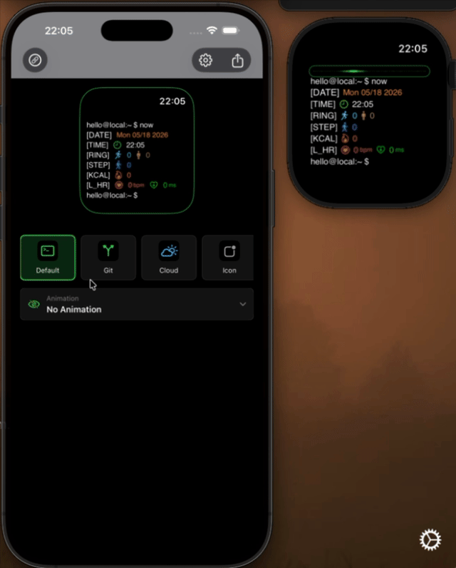

# zShellWatch

zShellWatch is a terminal-inspired Apple Watch companion app and widget project. The iPhone app is used to preview, configure, and sync a shell-style watch face, while the watchOS app displays the selected face on Apple Watch.

This project is inspired by:

- [kuglee/TermiWatch](https://github.com/kuglee/TermiWatch/)
- [qianlishun/TermiWatchWidget](https://github.com/qianlishun/TermiWatchWidget)

Important limitation: `zShellWatch` is not an Apple system watch face and does not replace the default watch face. It renders a watch-face-like screen inside the watchOS app, so the face is visible while the watch app is open.

## Features

### Quick Preview



### iPhone control app

- Live Apple Watch-style preview in the main screen.
- Dark terminal UI with a gray navigation bar.
- Navigation bar actions for connection status, line configuration, and watch sync.
- Auto-hiding sync feedback toast instead of blocking alert dialogs.
- Status panel for Location, Health, Watch pairing, Weather source, and last sync state.
- Terminal user and machine name configuration.
- Shared settings storage through App Groups.

### Watch face preview and watch app

- Terminal prompt layout similar to `user@machine:~ $`.
- Configurable command prompt line.
- Status-bar-like current time in the iPhone preview so the preview resembles the real watch app.
- Apple Watch-shaped rounded preview border.
- Dynamic preview height based on visible face lines.
- Watch app receives the configured face from the iPhone app and displays only that synced face.

### Configurable face lines

Users can choose which lines appear and reorder them from the Face Lines screen.

Available lines include:

- Command Prompt
- Date
- Time
- Current Weather
- Temperature
- Humidity
- Next Weather
- Battery
- Rings
- Steps
- Calories
- Heart Rate
- Prompt

Weather lines are hidden automatically when no weather provider is configured. Health lines require HealthKit permission.

### Themes

zShellWatch includes multiple terminal-style themes:

- Default Theme: classic terminal face.
- Git Theme: git prompt styling, branch label, rotating line colors, and badge-style changed values.
- Cloud Theme: cloud/thunder prompt styling with rainbow text behavior.
- Icon Theme: icon-first layout with face line labels removed.
- Colorful Theme: rainbow prompt styling and stronger accent colors.

### Animations

The top status area can show a selectable animation:

- Dot Line
- Matrix Text
- Pacman
- Terminal Cursor
- Command Loader
- Signal Sweep
- No Animation

Animations are intentionally small and status-bar sized so they do not cover the watch face content.

### Sync

The iPhone app syncs the selected face configuration to Apple Watch using WatchConnectivity. Sync includes:

- Visible face lines and order.
- Selected theme.
- Selected animation.
- Terminal user.
- Machine name.

The app shows lightweight sync feedback so it is easier to tell whether the watch received the latest configuration.

### Health

HealthKit support is used for activity and health-related face lines, including rings, steps, calories, and heart rate. Health data requires user permission on device.

HealthKit can be controlled from:

```swift
let qUseHealthKit = true
```

### Weather

Weather support is optional. If no provider is configured, the weather feature is disabled and weather face lines are hidden.

Supported weather modes:

- QWeather API key through `HFWeatherKey`.
- WeatherKit through `qUseWeatherKit`.
- Disabled when both are unavailable.

Configuration is in [QConfiguration.swift](TermiWatchWidget/Configuration/QConfiguration.swift):

```swift
let qUseWeatherKit = false
let HFWeatherKey = ""
```

Personal Apple development teams may not support the WeatherKit capability. In that case, keep WeatherKit disabled and use QWeather only if you have a key.

### Widgets

The project includes widget targets for terminal-style weather and health information. Weather widgets follow the same provider rule as the main app: if no weather provider is configured, weather data is skipped.

### SVG weather icons

The `SVGView` code is used to render bundled weather SVG icons from `HFBundle.bundle` for QWeather conditions. It is not a general user-facing SVG image feature.

## Requirements

- Xcode.
- iOS app target.
- watchOS app target.
- Paired Apple Watch or iOS/watchOS simulators.
- App Groups capability for shared settings.
- HealthKit capability if health lines are enabled.
- Optional QWeather key or WeatherKit capability for weather lines.

## Setup

1. Open `TermiWatchWidget.xcodeproj` in Xcode.
2. Select the `TermiWatchWidget` scheme.
3. Configure signing for the iOS app, watch app, and widget targets.
4. Confirm the App Group matches:

```swift
let qGroupBundleID = "group.com.github.lunf.zShellWatch"
```

5. Enable HealthKit if you want health lines.
6. Configure weather only if you want weather lines:

```swift
let HFWeatherKey = "your-qweather-key"
```

or:

```swift
let qUseWeatherKit = true
```

7. Build and run the iOS app on a paired iPhone or simulator.
8. Install the watch app on Apple Watch.
9. Use the iPhone app to configure the face, then tap the sync action in the navigation bar.

## Project Structure

- [TermiWatchWidget/TermiWatchApp.swift](TermiWatchWidget/TermiWatchApp.swift): main iPhone app screen.
- [TermiWatchWidget/App/Components](TermiWatchWidget/App/Components): iPhone UI components such as the preview, theme picker, animation picker, sync toast, status panel, and face line editor.
- [TermiWatchWidget/Configuration](TermiWatchWidget/Configuration): shared face configuration, themes, animations, line definitions, sync payload, and settings storage.
- [TermiWatchWidget Watch App](TermiWatchWidget%20Watch%20App): watchOS app and watch face rendering.
- [TermiWatchWidget_Widget](TermiWatchWidget_Widget): widget extension, weather utilities, and health observer.
- [TermiWatchWidget/SVGView](TermiWatchWidget/SVGView): SVG rendering support for bundled weather icons.

## Known Limitations

- This app cannot install a real Apple system watch face.
- The watch face display depends on the watchOS app staying open.
- watchOS may sleep or background the app according to system rules.
- Custom background images are not supported.
- Weather lines are disabled unless QWeather or WeatherKit is configured.
- Health lines require HealthKit permission and device support.
- Watch sync requires the companion watch app to be installed and paired.

## License

This project is licensed under GPL-3.0. See [LICENSE.md](LICENSE.md).
